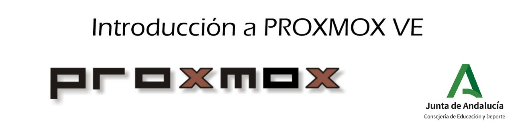

# Curso PROXMOX VE

## Título del curso

Introducción a Proxmox VE

## Descripción

Desde hace varios años se ha ido extendiendo el uso de la virtualización como técnica que nos permite aumentar el rendimiento de los equipos informáticos. De esta manera el trabajo con máquinas virtuales, y más recientemente el uso de contenedores, han facilitado la gestión de las aplicaciones y servicios ofrecidos por un equipo informático.

El concepto de virtualización hace referencia a una tecnología que permite la ejecución de varias máquinas virtuales sobre una máquina física con el objetivo de aprovechar al máximo los recursos de un sistema y que su rendimiento sea mayor. Esto nos ofrece la posibilidad de crear instancias con distintos sistemas operativos en un único servidor, utilizando así menos equipos para ejecutar una mayor cantidad de aplicaciones.

Desde el punto de vista educativo, el uso de la virtualización ha cambiado la forma de impartir los contenidos de los curriculum de los módulos de los ciclos formativos de la familia de informática. Podemos señalar varias ventajas que nos aporta su uso: los alumnos tienen una plataforma donde crear diferentes escenarios, obtener máquinas de una forma ágil, tener escenarios reproducibles, probar nuevos sistemas operativos, ...

En este curso conoceremos las principales características de Proxmox VE. Esta aplicación nos proporciona la gestión de máquinas virtuales y contenedores de una forma sencilla y centralizada en un servidor o grupo de servidores. De esta manera, gestionamos recursos virtualizados en un servidor, con lo que obtenemos la independencia de usar los equipos de los alumnos y nos ofrece un servicio centralizado para la gestión de la virtualización.

## Destinatarios

El curso va dirigido a docentes que impartan docencia en ciclos pertenecientes a la familia profesional de informática y que tengan conocimientos previos sobre el uso de alguna herramienta de virtualización, instalación de sistemas operativos y gestión básica de la línea de comandos.

## Requisitos

Lo ideal para la realización de este curso es el uso de un equipo físico donde se instale el software Proxmox VE. Como somos conscientes que puede ser complicado cumplir este requisito, se utilizará una máquina virtual para la instalación del software (preferiblemente una máquina virtual gestionada en VirtualBox). Los requisitos recomendables para dicha máquina serían:

* **8 Gb de RAM**
* **100 Gb de disco duro**
* **4 núcleos de CPU**

### Objetivos

El principal objetivo de este curso es conocer la herramienta Proxmox VE. Estudiaremos los aspectos fundamentales que nos ofrece para la gestión de máquinas virtuales y contenedores.

De forma más concreta estos objetivos se pueden enumerar en:

* Conocer las diferentes técnicas de virtualización que nos ofrece Proxmox VE.
* Gestionar el ciclo de vida de las máquinas virtuales en Proxmox VE.
* Conocer y trabajar con las distintas fuentes de almacenamiento que nos ofrece este sistema.
* Gestionar el ciclo de vida de los contenedores LCX en Proxmox VE.
* Conocer los aspectos fundamentales de la gestión de redes en Proxmox VE.
* Introducir los conceptos más importantes para la gestión de usuarios.

Finalmente, la realización de este curso puede ayudar a los profesores de la familia de Informática a reflexionar sobre la conveniencia de instalar un servidor Proxmox VE en la infraestructura de sus departamentos, para ofrecer los servicios de virtualización a sus alumnos.

## Contenidos

1. Introducción a la virtualización con Proxmox VE
    * [¿Qué es la virtualización?](modulo1/virtualizacion.md)
    * [Tipos de virtualización](modulo1/tipos.md)
    * [Introducción a Proxmox VE](modulo1/proxmox.md)
        * [Actividad 1.1: Foro: ¿Qué experiencia previa tienes sobre virtualización?](modulo1/actividad1.md)
    
2. Instalación de Proxmox VE
    * [Escenarios para la instalación de Proxmox VE](modulo2/escenarios.md)
    * [Preparando un laboratorio para testear Proxmox VE](modulo2/laboratorio.md)
    * [Instalación de Proxmox VE](modulo2/instalacion.md)
    * [Acceso a la GUI de Proxmox VE](modulo2/acceso.md)
    * [Vista general de la GUI de Proxmox VE](modulo2/vista_general.md)
    * [Introducción al clúster Proxmox VE](modulo2/introduccion_cluster.md)
    * [Almacenamiento y redes disponibles](modulo2/almacenamiento_redes.md)
        * [Actividad 2.1: Instalación y acceso a Proxmox VE (OBLIGATORIA)](modulo2/actividad1.md)

3. Creación de máquinas virtuales
    * [Gestión de imágenes ISO](modulo3/iso.md)
    * [Dispositivos paravirtualizados](modulo3/paravirtualizados.md)
    * [Creación de máquinas virtuales Linux](modulo3/creacion_linux.md)
    * [Gestión de máquinas virtuales](modulo3/gestion.md)
    * [Características y hardware de las máquinas virtuales](modulo3/caracteristicas.md)
    * [Creación de máquinas virtuales Windows](modulo3/creacion_windows.md)
    * [Instalación de Qemu-guest-agent en las máquinas virtuales](modulo3/agent.md)
    * [Acceso a las máquinas virtuales desde el exterior](modulo3/acceso.md)
        * [Actividad 3.1: Creación de una máquina virtual Linux (OBLIGATORIA)](modulo3/actividad1.md)
        * [Actividad 3.2: Creación de una máquina virtual Windows (OBLIGATORIA)](modulo3/actividad2.md)
        * [Actividad 3.3: Instalación de Qemu-guest-agent (VOLUNTARIA)](modulo3/actividad3.md)
        * [Actividad 3.4: Instalación de servicios en una máquina virtual (VOLUNTARIA)](modulo3/actividad4.md)

4. Gestionando el almacenamiento
    * [Introducción al almacenamiento en Proxmox VE](modulo4/almacenamiento.md)
    * [Creación de una fuente de almacenamiento de tipo Directory](modulo4/directory.md)
    * [Añadir nuevos discos a una máquina virtual](modulo4/nuevo_almacenamiento.md)
    * [Gestión de los discos de una máquina virtual](modulo4/gestion_almacenamiento.md)
        * [Actividad 4.1: Creación de una fuente de almacenamiento para trabajar con imágenes de discos (OBLIGATORIA)](modulo4/actividad1.md)
        * [Actividad 4.2: Añadir nuevos discos a una máquina virtual (OBLIGATORIA)](modulo4/actividad2.md)
        * [Actividad 4.3: Gestión de discos (VOLUNTARIA)](modulo4/actividad3.md)

5. Clonación, instantáneas y copias de seguridad
    * [Clonación de máquinas virtuales](modulo5/clonacion.md)
    * [Convirtiendo máquinas virtuales en plantillas](modulo5/plantillas.md)
    * [Snapshots de máquinas virtuales](modulo5/snapshot.md)
    * [Copias de seguridad de máquinas virtuales](modulo5/backup.md)
        * [Actividad 5.1: Clonación de máquinas virtuales (OBLIGATORIA)](modulo5/actividad1.md)
        * [Actividad 5.2: Trabajando con plantillas (OBLIGATORIA)](modulo5/actividad2.md)
        * [Actividad 5.3: Snapshots de máquinas virtuales (VOLUNTARIA)](modulo5/actividad3.md)
        * [Actividad 5.4: Copias de seguridad de máquinas virtuales (VOLUNTARIA)](modulo5/actividad4.md)

6. Trabajando con Linux Containers
    * [Proxmox y LXC](modulo6/introduccion.md)
    * [Gestionando plantillas de contenedores](modulo6/plantillas.md)
    * [Creación de contenedores Linux](modulo6/contenedor.md)
    * [Gestión de contenedores Linux](modulo6/gestion.md)
    * [Añadir almacenamiento a un contenedor LXC](modulo6/mount.md)
        * [Actividad 6.1: Creación de un contenedor LXC (OBLIGATORIA)](modulo6/actividad1.md)
        * [Actividad 6.2: Añadir almacenamiento a un contenedor LXC (OBLIGATORIA)](modulo6/actividad2.md)

7. Introducción a las redes en Proxmox
    * [Gestionando redes en Proxmox VE](modulo7/introduccion.md)
    * [Configuración de la red del servidor Proxmox VE](modulo7/red_servidor.md)
    * [Configuración de una red interna](modulo7/red_interna.md)
    * [Conexión de una máquina virtual a la red interna](modulo7/conexion_red_intena.md)
    * [Conexión de un contenedor LXC a la red interna](modulo7/conexion_red_intena2.md)
    * [Introducción al cortafuegos de Proxmox VE](modulo7/cortafuegos.md)
        * [Actividad 7.1: Creación de un red interna (OBLIGATORIA)](modulo7/actividad1.md)
        * [Actividad 7.2: Trabajando con el cortafuegos (OBLIGATORIA)](modulo7/actividad2.md)
        * [Actividad 7.3: Configuración de un router (VOLUNTARIA)](modulo7/actividad3.md)
        

8. Gestión de usuarios en Proxmox VE
    * [Introducción a la gestión de usuarios](modulo8/introduccion.md)
    * [Gestión de Usuarios y Grupos](modulo8/usuarios.md)
    * [Gestión de Pools de Recursos](modulo8/pools.md)
    * [Gestión de Permisos](modulo8/permisos.md)
    * [Ejemplo 1: Especificar tipos de usuarios](modulo8/ejemplo1.md)
    * [Ejemplo 2: Aislamiento de usuarios](modulo8/ejemplo2.md)
        * [Actividad 8.1: Gestión de usuarios (OBLIGATORIA)](modulo8/actividad1.md)

## Agenda

Con objeto que los participantes en el curso puedan planificar sus sesiones de trabajo, a modo orientativo se elabora la siguiente Agenda. En la columna "Actividad" se indicará el nombre de la misma. Además, si dicha actividad necesita la revisión del tutor o tutora, se pondrá (T). Bajo la columna "Horas" encontrará el tiempo aproximado que estimamos le llevará realizar cada actividad. La columna "Semana" indica la semana del curso en que debería estar trabajando en la actividad, teniendo en cuenta que se valoran aproximadamente 5-6 horas por semana.

| MÓDULO | ACTIVIDAD | HORAS | SEMANA |
| :----: | :-------- | :---: | :----: |
| INICIO | 0.1. Guía del curso | 30' | 1ª |
| INICIO | 0.2. Ayuda para conocer el Aula Virtual | 1 h | 1ª |
| INICIO | 0.3. Nos presentamos (T) (OBLIGATORIA) | 30' | 1ª |
| MOD 1 | 1.1: Foro: ¿Qué experiencia previa tienes sobre virtualización? (T) | 30' | 1ª |
| MOD 2 | 2.1: Instalación y acceso a Proxmox VE (T) | 1 h | 2ª |
| MOD 3 | 3.1: Creación de una máquina virtual Linux (T) | 1 h | 3ª |
| MOD 3 | 3.2: Creación de una máquina virtual Windows (T) | 1 h | 3ª |
| MOD 3 | 3.3: Instalación de Qemu-guest-agent (VOLUNTARIA) | 1 h | 3ª |
| MOD 3 | 3.4: Instalación de servicios en una máquina virtual (VOLUNTARIA) | 1 h | 3ª |
| MOD 4 | 4.1: Creación de una fuente de almacenamiento para trabajar con imágenes de discos (T) | 1 h | 4ª |
| MOD 4 | 4.2: Añadir nuevos discos a una máquina virtual (T) | 1 h | 4ª |
| MOD 4 | 4.3: Gestión de discos (VOLUNTARIA) | 1 h | 4ª |
| MOD 5 | 5.1: Clonación de máquinas virtuales (T) | 1 h | 5ª |
| MOD 5 | 5.2: Trabajando con plantillas (T) | 1 h | 5ª |
| MOD 5 | 5.3: Snapshots de máquinas virtuales (VOLUNTARIA) | 1 h | 5ª |
| MOD 5 | 5.4: Copias de seguridad de máquinas virtuales (VOLUNTARIA) | 1 h | 5ª |
| MOD 6 | 6.1: Creación de un contenedor LXC (T) | 1 h | 6ª |
| MOD 6 | 6.2: Añadir almacenamiento a un contenedor LXC (T) | 1 h | 6ª |
| MOD 7 | 7.1: Creación de un red interna (T) | 1 h | 7ª |
| MOD 7 | 7.2: Trabajando con el cortafuegos (T) | 1 h | 7ª |
| MOD 7 | 7.3: Configuración de un router (VOLUNTARIA) | 1 h | 7ª |
| MOD 8 | 8.1: Gestión de usuarios (T) | 1 h | 8ª |
| FINAL | Foro de Reflexión. ¿Utilizarías Proxmox VE en tu instituto? (OBLIGATORIA) (T) | 30' | 8ª |
| FINAL | Foro: Nos depedimos | 30' | 8ª |
| FINAL | Cuestionario de valoración del curso (OBLIGATORIA) | 30' | 8ª |

El RESTO DE LAS HORAS HASTA LAS 40 HORAS DEL CURSO DEBEN DEDICARSE A LA LECTURA DE LOS MATERIALES Y AL VISIONADO DE LOS VIDEOTUTORIALES INCLUIDOS.

## Metodología

El curso está pensado como una secuencia lógica para aprender los conceptos fundamentales e introducir los diferentes elementos de Proxmox VE, hasta llegar a dominar la gestión de recursos virtualizados usando un servidor Proxmox. 

Los módulos del curso contarán con al menos los siguientes materiales:

* Materiales en HTML con explicaciones detalladas y directas sobre las distintas operaciones que estemos llevando a cabo.
* Una colección de vídeos donde se mostrará las distintas operaciones funcionando.
* Enlaces a materiales adicionales.

Además, se celebrará una videoconferencia a mediados del curso para que los alumnos puedan preguntar a los tutores las dudas concretas que vayan surgiendo. También se hablará de las posibilidades de instalar un servidor Proxmox en los institutos de los distintos participantes.

Podemos distinguir las siguientes partes en el curso:

1. Una primera parte más conceptual en la que veremos los conceptos más teóricos sobre virtualización y la presentación de Proxmox VE como sistema de gestión de la virtualización.
2. En la segunda parte del curso, que está formado por la mayor parte de módulos, iremos viendo de forma progresiva los diferentes elementos de Proxmox VE y como nos ayudan a gestionar los recursos virtualizados.

En todo momento contarás con la ayuda de un tutor o tutora que te facilitará tu paso por la actividad formativa y se fomentará la participación a través de los foros para compartir dudas y cualquier otra cuestión.

## Licencia

Materiales desarrollados por José Domingo Muñoz Rodríguez para el curso "Introducción a Proxmox VE"
organizado por la [Consejería de Educación y Deporte de la Junta de Andalucía](https://www.juntadeandalucia.es/educacion/portals/web/ced) y dirigido a profesorado de secundaria de Andalucía.

Toda la documentación es libre y puede compartirse y modificarse bajo las limitaciones de la licencia Creative Commons [BY-NC-SA](https://creativecommons.org/licenses/by-nc-sa/4.0/deed.es).
