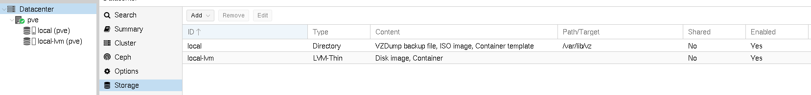
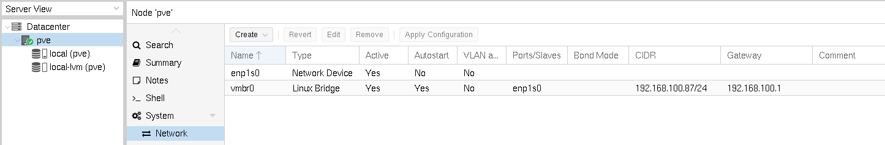

# Almacenamiento y redes disponibles

Cuando instalamos Proxmox VE tenemos a nuestra disposición algunos
recursos ya creados.

## Almacenamiento

Por defecto tenemos creadas dos fuentes de almacenamiento:

### local

Es un almacenamiento de tipo *Directory* y por defecto en este
almacenamiento se podrán guardar:

* Ficheros de copia de seguridad.
* Imágenes ISO.
* Plantillas de contenedores.

Al ser tipo *Directory* esta información se guardará en un directorio
del nodo, en concreto se guardará en `/var/lib/vz`.

### local-lvm

Es un almacenamiento de tipo *LVM-Thin*, en él se podrán guardar:

* Imágenes de discos para las máquinas virtuales.
* Sistema de ficheros de los contenedores Linux.

Cuando creemos una máquina virtual o un contenedor los ficheros de su
disco se guardarán en un volumen lógico LVM de un grupo de volúmenes
con aprovisionamiento ligero, por lo que el volumen lógico creado no
ocupará todo el espacio desde el principio, ira creciendo según
vayamos creando y modificando ficheros. Es un mecanismo muy eficaz y
rápido de utilizar almacenamiento de forma óptima y se utiliza
ampliamente en centros de datos.

Hay muchos tipos de fuentes de almacenamiento, su creación y
configuración lo veremos en el módulo correspondiente.

## Redes virtuales

Por defecto, al instalar Proxmox VE, tenemos configurada una red pública:

* `enp1s0`: Es la interfaz física del nodo.
* `vmbr0`: Es un *Linux Bridge* al que está conectado el nodo. En este
  bridge se conectarán por defecto las máquinas virtuales y
  contenedores que vamos a crear, que tomarán direccionamiento del
  servidor DHCP de nuestra infraestructura y que tomarán una dirección
  IP con el mismo direccionamiento que el nodo, por lo que serán
  accesibles desde cualquier equipo de la red local.

En mi caso, la red que tengo configurada tendrá direccionamiento
`192.168.100.0/24` y la puerta de acceso es la `192.168.100.1`, pero
en general se corresponderá a la red local a la que se conectó Proxmox
durante la instalación.

Evidentemente, podremos crear más redes. Su creación y configuración
lo estudiaremos en el módulo correspondiente del curso.

* [Vídeo: Almacenamiento y redes disponibles](https://youtu.be/eznn-ycu5dw)
