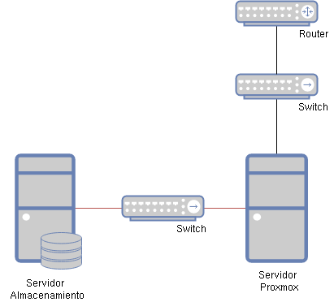

# Escenarios para la instalación de Proxmox VE

Antes de explicar la instalación de Proxmox VE vamos a estudiar los posibles escenarios e infraestructura donde podemos instalar Proxmox VE.

## Instalación de Proxmox VE en nuestro centro educativo

Si queremos utilizar Proxmox VE como herramienta de virtualización para ofrecer recursos virtualizados a los alumnos de nuestros ciclos tendremos que utilizar máquinas físicas con recursos suficientes:

* CPU: No es crítico, las máquinas virtuales y contenedores utilizarán CPU virtuales para su ejecución. 
* RAM: Al crear una máquina virtual o un contenedor se ira reservando memoria RAM. Por lo tanto dependiendo del tipo de sistema operativo que vayamos a instalar tendremos necesidades distintas.
* Almacenamiento: El almacenamiento que van a utilizar nuestras máquinas virtuales o contenedores podría ser proporcionado de distintas maneras:

    * DAS (Direct-Attached Storage): Los dispositivos de almacenamiento están alojados en el propio servidor Proxmox VE
    * NAS (Network Attached Storage): En este caso tenemos un servidor de almacenamiento que nos permite compartir sistemas de ficheros (por ejemplo NFS). 
    * SAN (Storage Area Network): En este caso, el servidor de almacenamiento nos permite compartir dispositivos de almacenamiento (de bloque) (por ejemplo iSCSI).

Veamos dos posibles escenarios para la instalación de Proxmox VE en nuestro centro educativo:

### Instalación de Proxmox VE en un solo nodo

Realmente Proxmox VE nos permite la construcción de un cluster de servidores para la virtualización de recursos. En un centro educativo puede ser una opción muy adecuada empezar a usar Proxmox con un solo servidor. No tendríamos las características avanzadas que nos ofrece el cluster (alta disponibilidad, migración de recursos,...) pero siempre podemos escalar nuestra infraestructura y crear un cluster posteriormente. Tendríamos ods posibilidades:

**Un solo servidor Proxmox**

Utilizamos un servidor Proxmox VE conectado a la red de nuestro departamento. PPor defecto, las máquinas virtuales y contenedores creados estarán conectadas a esta misma red, por lo que serán accesibles sin problemas. En este caso se utilizará almacenamiento DAS, es decir, el servior tendrá que tener suficiente disco duro para todos los recursos virtualizados.

**Un servidor Proxmox y un servidor de almacenamiento**

En este caso tendremos dos servidores: uno para la ejecución de recursos virtualizados (Proxmox) y otro que ofrece el almacenamiento. En este caso el disco duro del servidor Proxmox no necesita que tenga gran capacidad. En este esque ma se puede ofrecer almacenamiento NAS o SAN. Por último indicar que se suelen usar redes diferenciadas: la red de acceso a las máquinas (negra) y la red de almacenamiento (roja).

### Instalación de un cluster Proxmox VE

Para sacar toda su potencial a Proxmox necesitamos instalar un cluster de servidores. En este caso tendríamos varios servidores donde se virtulizarían nuestros recursos. En este esquema si sería necesario tener un sistema de almacenamiento compartido para que los datos de nuestros recursos virtualizados fueran compartidos entre los distintos nodos del cluster.

Es recomendable tener una red aislada que conecte los nodos del cluster para la gestión interna del mismo.

## Instalación de Proxmox VE en este curso

En este curso vamos a montar un laboratorio para aprender los conceptos más importante de Proxmox VE. Por lo tanto os proponemos lo siguiente:

* La instalación de un sólo nodo de Proxmox en una máquina virtual. El ámbito de este curo no nos va a permitir el estudio de un cluster con varios servidores de Proxmox.
* La máquina virtual donde vamos a instalar Proxmox la podemos crear en cualquier hypervisor: VirtualBox, VMWare, KVM, HyperV,...
* Las características mínimas de esa máquina virtual serían 4 Gb de RAM y 40 Gb de disco duro. Evidentemente cuanto más recursos asignemos a esa máquina más máquinas virtuales y contenedores podremos crear en nuestro Proxmox.
* La máquina virtual debe tener una interfaz de red de tipo "bridge". es decir debe estar conectada a la misma red del anfitrión. Todas las máquinas virtuales y contenedores que creemos, por defecto, estarán conectados a la misma red.

Evidentemente virtualizar dentro de una máquina virtual no es lo más adecuado, por lo que os animamos a intentar realizar el curso usando una máquina física para la instalación de Proxmox.
