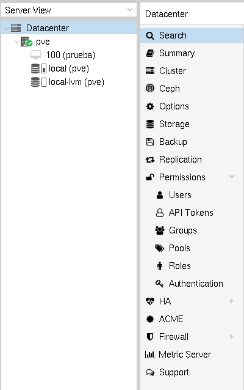
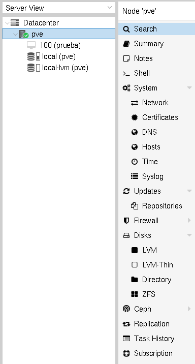

# Introducción al cluster Proxmox VE

Al instalar Proxmox VE se crea un cluster de servidores donde se van a
ejecutar las máquinas virtuales, se va administrar el
almacenamiento, ... Evidentemente, al hacer la primera instalación el
cluster solo tiene un servidor.

Por lo tanto la estructura de nuestro cluster Proxmox VE esta formada
por:

* *Datacenter*: Que representa el cluster. El Datacenter está formado
  por:
* *Nodos*: Representan a cada servidor que forma parte del cluster.

## Datacenter

Al elegir el **Datacenter** en la *Server View*, nos aparecen las
opciones del cluster en el panel lateral, veamos algunas de ellas:

* **Search**: Para realizar búsquedas en todo el cluster: nodos,
  máquinas virtuales, contenedores, almacenamiento, ...
* **Summary**: Ofrece una breve descripción general del estado del
  cluster y el uso de recursos.
* **Cluster**: Proporciona la funcionalidad y la información
  necesarias para crear o unirse a un cluster. Con un solo nodo
  todavía no tenenos la funcionalidad de cluster, la estudiaremos
  posteriormente.
* **Options**: Configuración general del cluster.
* **Storage**: Nos permite gestionar el almacenamiento del cluster.
* **Backup**: Nos proporciona la posibilidad de crear copias de
  seguridad de los recursos de nuestro cluster.
* **Replication**: Cuando tenemos más de dos nodos podemos administrar
  tareas de replicación de máquinas y contenedores en este apartado.
* **Permissions**: Podemos administrar usuarios, grupos, permisos,
  reoles, ... a nivel del cluster.
* **HA**: Si tenemos más de un nodo podemos administrar los recursos
  que van a estar en alta disponibilidad.
* ...

## Nodos

Al elegir un determinado nodo del cluster, en la barra lateral nos
aprecen las opciiones propias de ese nodo, veamos algunas de ellas:

* **Search**: Para realizar búsquedas en el nodo.
* **Summary**: Ofrece una breve descripción general del nodo y el uso de recursos en él.
* **Notes**: Podemos escribir comentarios usando Markdown.
* **Shell**: nos permite acceder a la shell del nodo.
* **System**: Configura varios aspectos del nodo: red, DNS, certificados, resolución estática, logs, ...
* **Updates**: Nos permite gestionar los repositorios de paquetes y hacer actualizaciones del nodo.
* **Firewall**: Podemos configurar el cortafuego del nodo.
* **Disks**: Obtenemos información sobre los discos del nodo.
* ...
