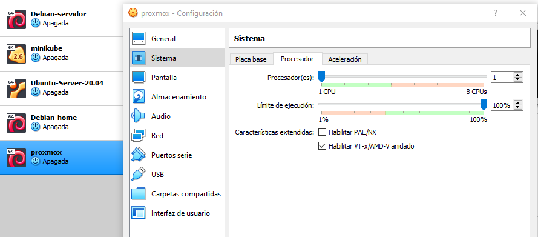
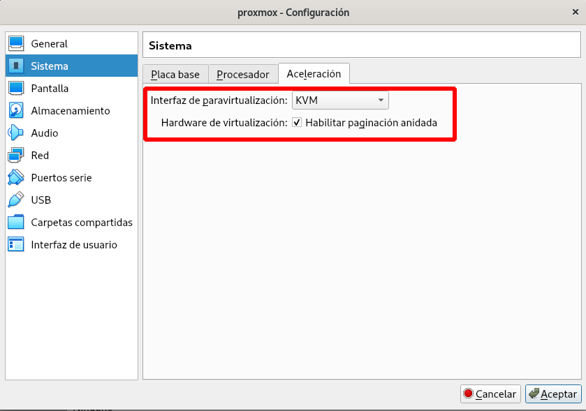
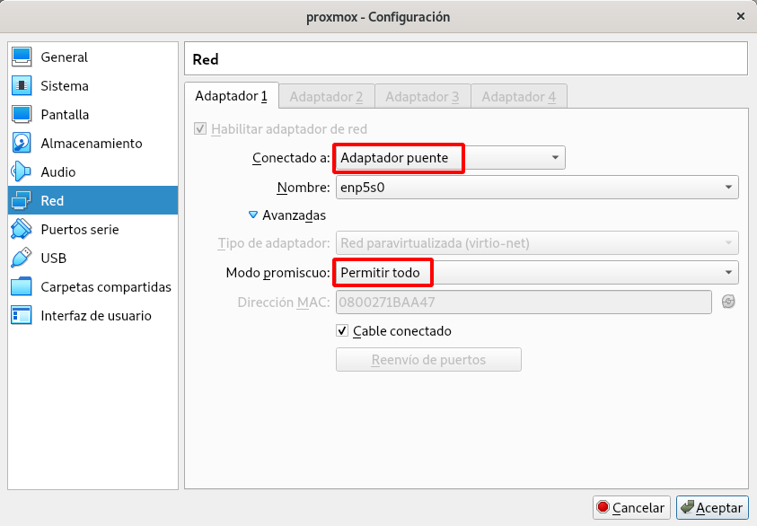
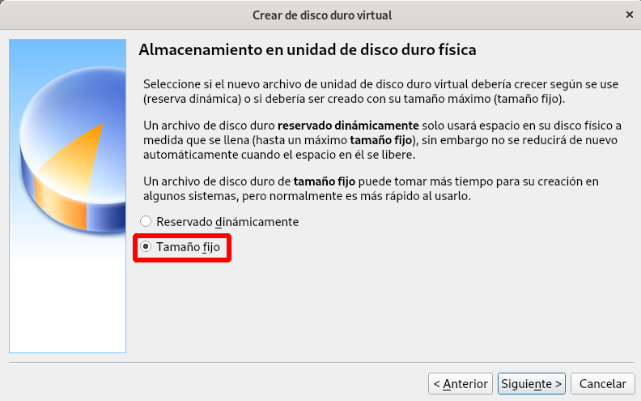
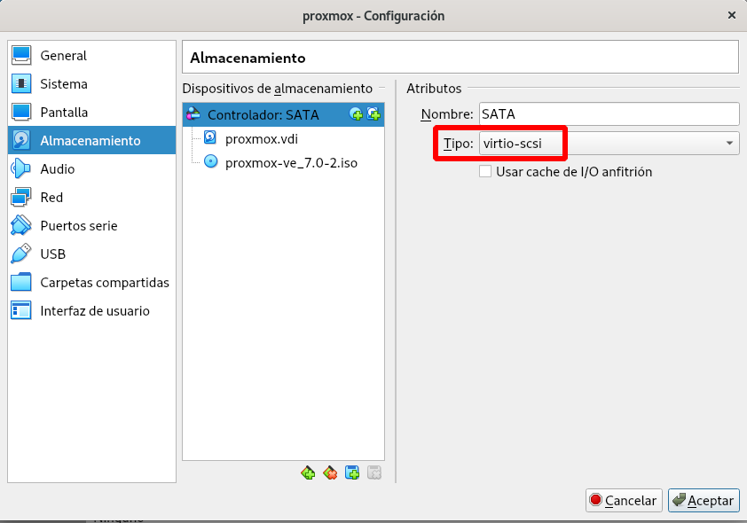
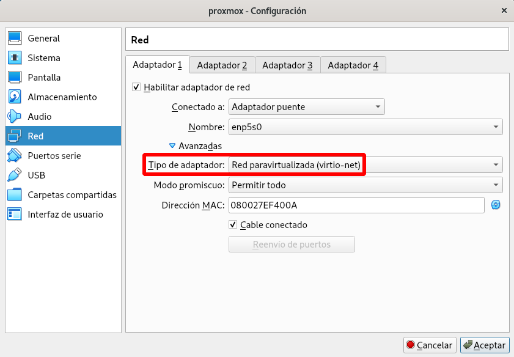

# Preparando un laboratorio para testear Proxmox VE

En este curso vamos a montar un laboratorio para aprender los
conceptos más importantes de Proxmox VE. Por lo tanto, os proponemos lo
siguiente:

* La instalación de **un sólo nodo de Proxmox** en una máquina virtual. El
  ámbito de este curso no nos va a permitir el estudio de un clúster
  con varios servidores Proxmox.
* La máquina virtual donde vamos a instalar Proxmox la podemos crear
  en cualquier hypervisor: **VirtualBox, VMWare, KVM, HyperV, ...**. Aunque en este curso vamos a suponer que elegimos VirtualBox como hipervisor más utilizado.

## Configuración de la máquina virtual donde realizaremos la instalación
  
  Dependiendo de la cantidad de memoria RAM, espacio de disco duro y VCPU que asignemos a la máquina virtual donde vamos a instalar Proxmox VE, podremos virtualizar más o menos máquinas virtuales o contenedores:

  * Por ejemplo, desde el punto de vista de la RAM: si virtualizamos una máquina virtual sin entorno gráfico podemos asignarle 512Mb, si tiene entorno gráfico ya tendríamos que usar 1 o 2GB, si virtualizamos una máquina Windows al menos tendremos que asignar 2Gb de RAM.
  * Desde el punto de vista del almacenamiento: Este factor no es tan importante, pero tenemos que pensar que hay que almacenar las ISO para la instalación de las máquinas, los templates usados para la creación de los contenedores, las copias de seguridad de las máquinas,... y los discos duros de las máquinas virtuales. Este aspectos no es tan crítico, porque cómo veremos utilizaremos *aprovisionamiento ligero* que nos permite reducir el espacio ocupado por las máquinas virtuales.
  * Al crear máquinas virtuales o contenedores podremos asignarle cores virtuales de CPU, por lo que aumentará el rendimiento si asignamos a nuestra máquina virtual suficientes núcleos de CPU.

Por todo lo explicado a continuación la **configuración recomendada** para la máquina virtual sería:

* **8 Gb de RAM**
* **100 Gb de disco duro**
* **4 núcleos de CPU**

Podemos asignar menos recursos, pero reduciremos las posibilidades de crear muchas máquinas virtuales y contenedores. Del mismo modo,cuantos más recursos asignemos a esa máquina más máquinas virtuales y contenedores podremos crear en nuestro Proxmox.

La máquina virtual debe tener una **interfaz de red de tipo "bridge"**; es decir, debe estar conectada a la misma red del
  anfitrión. Todas las máquinas virtuales y contenedores que creemos, por defecto, estarán conectados a la misma red.

Quien tenga la opción de utilizar una máquina física dedicada para
Proxmox puede hacerlo allí, pero no podemos considerar esta opción
como la más habitual, por lo que asumiremos que la mayoría de los
participantes utilizarán una máquina virtual en su propio equipo.

## Configuración especifica de VirtualBox para la instalación de Proxmox

Consideramos que el hipervisor más común que podemos usar para la creación de la máquina virtual donde vamos a instalar Proxmox VE es VirtualBox. Para esta configuración se ha usado la versión **6.1.34**, en versiones anteriores puede que no exista alguna configuración o se encuentre modificada. Por lo tanto siguiendo estas [instrucciones](https://pve.proxmox.com/wiki/Proxmox_VE_inside_VirtualBox) tenemos que tener en cuenta los siguientes aspectos:

### Configuraciones necesarias

* Hay que habilitar la virtualización anidada: Para ello: **Sistema - Procesador**:

* Hay que habilitar KVM como interfaz de paravirtualización y habilitar paginación anidada. Para ello: **Sistema - Aceleración**:

* Hay que configurar la red de la máquina en modo **Adaptador puente** y habilitar el **[modo promiscuo](https://es.wikipedia.org/wiki/Modo_promiscuo)**. Es recomendable que el adaptador puente utilice una interfaz física cableada para la conexión. Si conectamos el adaptador puente con una conexión wifi podemos experimentar problemas, ya que la mayoríia de las tarjetas wifi no soportan el **modo promiscuo**.

### Configuraciones recomendadas

Estas configuraciones son recomendadas para aumentar el rendimiento de la máquina virtual donde vamos a instalar Proxmox y de esta forma intentar mitigar el descenso de rendimiento en las máquinas creadas en el sistema a causa de la virtualización anidada que estamos haciendo.

* Al crear el disco duro de la máquina usar la opción **Tamaño fijo**. Normalmente escogemos discos con el modo **Reservado dinámicamente** donde va creciendo el espacio ocupado según las necesidades. Si reservamos inicialmente todo el espacio del disco aumentaremos el rendimiento.

* Usar dispositivos paravirtualizados, que ofrecen más rendimiento que otros modelos que están emulados. Escogeremos el modo **virtio-scsi** en la configuración del disco duro:

* Del mismo modo, el tipo de la interfaz de red será **virtio-net**:

