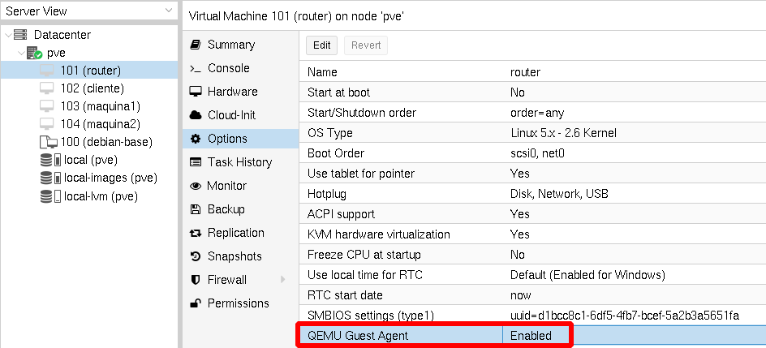
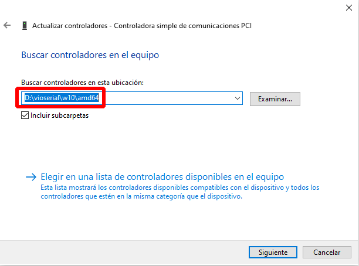
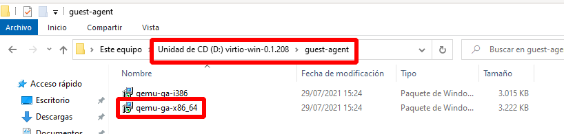

# Instalación de Qemu-guest-agent en las máquinas virtuales

El programa **Qemu-guest-agent** es un demonio que podemos instalar en las maquinas virtuales creadas en Proxmox que nos proporciona que haya una comunicación entre Proxmox y la máquina virtual. Esto nos puede permitir que la gestión del apagado de la máquina virtual sea más óptimo y tener información de la máquina, por ejemplo la ip que se ha configurado en sus interfaces de red.

## Configuración de Qemu-guest-agent

Para hacer uso de este programa debemos activarlo en la configuración de la máquina:

## Instalación de Qemu-guest-agent

Normalmente las máquinas Linux que creamos en Proxmox detectan que se están ejecutando en este entorno y durante la instalación se instala este servicio (por ejemplo en las máquinas Debian 11 se realiza la instalación automáticamente). Si no se realiza la instalación de forma automática podemos instalar el paquete, por ejemplo en Debian/Ubuntu:

    apt install qemu-guest-agent

Para el sistema operativo Windows, desde el CDROM donde hemos montado los drivers VirtIO:

1. Vamos al **Administrador de Dispositivos** (**Device Manager**).
2. Buscamos **"PCI Simple Communications Controller"**
3. Botón derecho-> Actualizar Controlador (Update Driver) -> Seleccionar la iso montada en `DRIVE:\vioserial\<carpeta con el nombre de tu versión de windows>/amd64`.

A continuación instalamos el programa:

1. Con el explorador de ficheros nos posicionamos en la unidad del CDROM correspondiente a la ISO montada.
2. El instalador se encuentra en el directorio `guest-agent`.
3. Ejecutamos el instalador `qemu-ga-x86_64.msi` (64-bit).

## Prueba de funcionamiento

Podemos obtener información de la IP que se asignado a la máquina:

Para más información: [Qemu-guest-agent](https://pve.proxmox.com/wiki/Qemu-guest-agent)