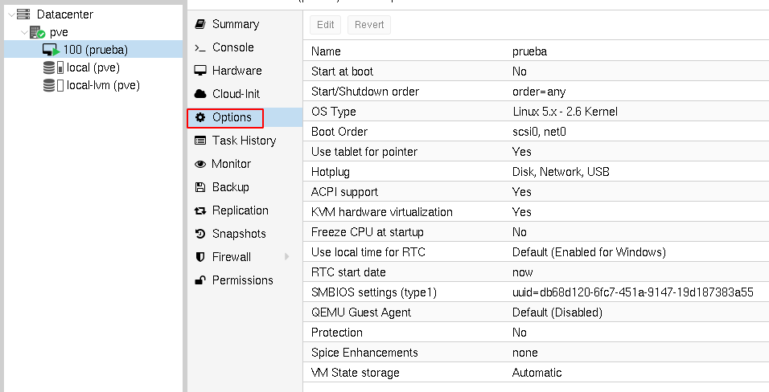
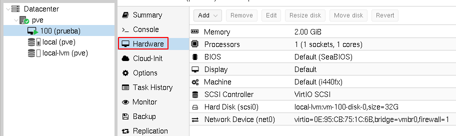
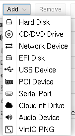
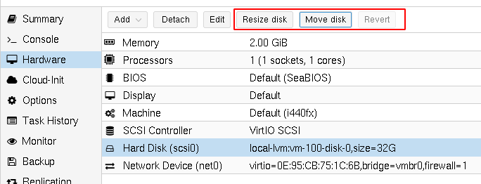

# Características y hardware de las máquinas virtuales

Las máquinas virtuales tienen una serie de opciones y configuración, además están formada por un conjunto de dispositivos hardware. Estos ajustes se pueden realizar durante la creación de la máquina o posteriormente una vez creadas. Para estudiar detalladamente todos los ajustes que podemos configurar puedes ver el capitulo 10 de la documentación oficial: [Qemu/KVM Virtual Machines](https://pve.proxmox.com/pve-docs/pve-admin-guide.html#chapter_virtual_machines). En este apartado vamos a ver los ajustes principales:

## Options

En el apartado *Options* podemos modificar los ajustes de la máquina virtual. El cambio de un parámetro puede requerir el reinicio de la máquina virtual para que se haga efectivo. Veamos algunos de ellos:

* **Name**: Podemos cambiar el nombre de la máquina.
* **Start at boot**: Podemos configurar la máquina para que se inicie de forma automática al iniciar Proxmox VE.
* **Start/Shutdown order**: Si está elegida la opción anterior podemos programar el orden de arranque de la máquina. [Más información](https://pve.proxmox.com/pve-docs/chapter-qm.html#qm_startup_and_shutdown).
* **OS Type**: Nos permite modificar el tipo y versión del sistema operativo.
* **Boot Order**: Configuramos el orden de arranque de los dispositivos de almacenamiento de la máquina.
* ...

## Hardware

   

Podemos ver y modificar  las características del hardware y dispositivos conectados a la máquina virtual (RAM, CPU, BIOS, Display, ...).

Podemos añadir nuevos dispositivos:

   

Iremos añadiendo nuevos dispositivos a nuestras máquinas en módulos posteriores del curso. Además, podemos eliminar dispositivos a nuestras máquinas.

Finalmente, las opciones sobre el almacenamiento las estudiaremos en el módulo dedicado al almacenamiento:

   

* [Vídeo: Características y hardware de las máquinas virtuales](https://youtu.be/87UVoyz_ALk)
