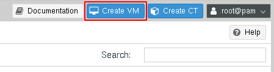
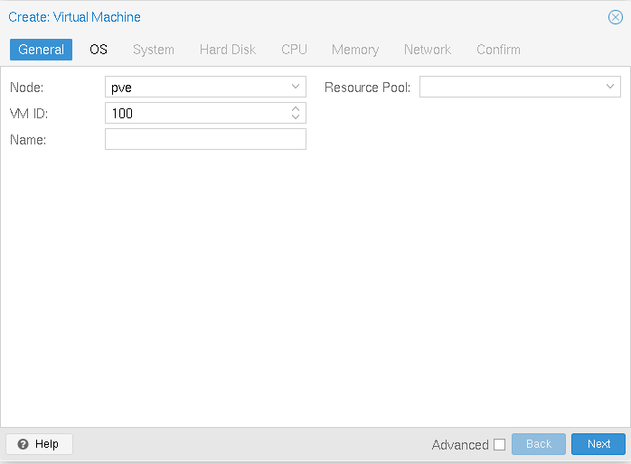

# Creación de máquinas virtuales Linux

Después de subir las imágenes ISO con las que vamos a trabajar, en este apartado vamos a explicar la creación de una máquina virtual con un sistema operativo linux. Sólo indicaremos las opciones más básicas para su creación, profundizando posteriormente en los próximos apartados.

Elegimos la opción de crear una máquina virtual:

Y seguimos los siguientes pasos:

### General

Indicamos el nodo donde se va a crear la máquina, su ID y su nombre.

### SO

