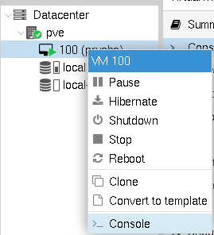
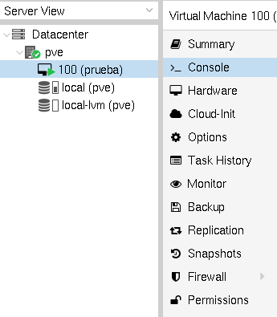
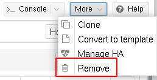

# Gestión de máquinas virtuales

Tenemos varias opciones para gestionar nuestras máquinas virtuales:

## Botón derecho sobre la máquina virtual

* **Start**: Iniciamos la ejecución de una máquina virtual.
* **Pause**: Pausa la ejecución de la máquina virtual. Podremos
  reanudar la ejecución con la opción **Resume**.
* **Hibernate**: Se guarda el estado de la máquina en memoria y se
  para. La próxima vez que iniciemos la máquina se recuperará el
  estado anterior de la máquina.
* **Shutdown**: Se termina la ejecución de la máquina de forma
  ordenada.
* **Stop**: Se termina inmediatamente la ejecución de la máquina.
* **Clone**: Nos permite clonar la máquina.
* **Convert to template**: Nos permite crear una plantilla a partir de
  la máquina para crear nuevas máquinas. Estas dos últimas opciones la
  estudiaremos en un módulo posterior.
* **Console**: Nos permite acceder a una consola para trabajar con la
  máquina.

## Panel lateral

Si elegimos una máquina virtual, nos aparece un panel lateral con más
opciones sobre la máquina:

* **Sumary**: Resumen y monitorización de la máquina elegida.
* **Console**: Nos permite acceder a una consola para trabajar con la máquina.
* **Hardware**: Nos permite ver y cambiar la configuración
  hardware. Lo estudiaremos en el siguiente apartado.
* **Cloud-init**: Cloud-init nos permite hacer una configuración
  automática de la máquina. No lo vamos a estudiar en este curso.
* **Options**: Nos permite modificar opciones de la máquina
  virtual. Lo estudiaremos en el siguiente apartado.
* **Task History**: Nos muestra el historial de tareas que se han
  realizado sobre la máquina.
* **Monitor**: Nos permite interaccionar directamente con KVM desde
  línea de comandos.
* **Backup**: Nos permite realizar una copia de seguridad. Lo
  estudiaremos en un módulo posterior.
* **Replication** Nos permite gestionar las réplicas de la máquina
  entre distintos nodos del clúster de Proxmox VE. Lo estudiaremos en
  un módulo posterior.
* **Snapshot**: Nos permite crear un snapshot de la máquina para
  recuperar posteriormente su estado. Lo estudiaremos en un módulo
  posterior.
* **Firewall**: Nos permite gestionar el cortafuego de la máquina
  virtual. Lo estudiaremos en un módulo posterior.
* **Permisssions**: Nos permite especificar los distintos permisos que
  tienes los usuarios o grupos sobre la máquina. Lo estudiaremos en un
  módulo posterior.

## Eliminar una máquina virtual

Para eliminar una máquina virtual tenemos que pararla, y escoger la opción
*Remove* del botón *More*:

Para eliminarla se nos pedirá el identificador de la máquina virtual
para la confirmación.
