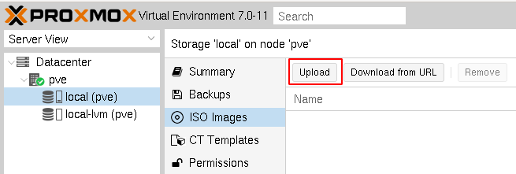
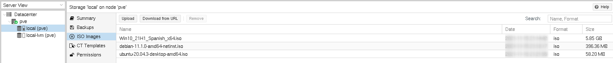

# Gestión de imágenes ISO

Antes de crear una máquina virtual, necesitamos subir las imágenes ISO de los sistemas operativos desde los que vamos ac crear las máquinas. Para ello en el almacenamiento *local*, seleccionamos la opción *ISO images* y subimos los ficheros que necesitemos:

También tenemos la posibilidad de indicar una URL para descargar la ISO.

Finalmente podremos ver las  lista de imágenes ISO que hemos subido a nuestro Proxmox VE:

