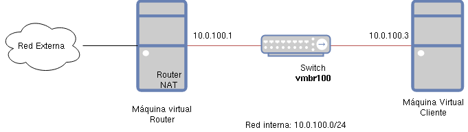

# ACTIVIDAD Nº 3

## TÍTULO DE LA ACTIVIDAD: Creación de un escenario de trabajo (3ª parte)

## TEXTO DE LA ACTIVIDAD

En la tercera parte de nuestra actividad voluntaria vamos a configurar la red interna de nuestro escenario, para ello:

1. Crea un bridge que llamaremos `vmbr100`.
2. Añade una interfaz de red, para conectar la máquina virtual `router` al bridge que hemos creado.
3. Desconecta la máquina virtual `cliente` del bridge `vmbr0` y conéctalo al nuevo bridge que hemos creado.
4. Vamos a configurar las interfaces de red de las máquinas como vemos en el siguiente esquema:



Veamos los pasos que tenemos que realizar:

**Configuración de `router`**

Accedemos a la máquina `router` y como `root` ejecutamos `ip link show` para mostrar el nombre de las interfaces. La nueva interfaz que hemos añadido es la segunda, la que no está activa (`status DOWN`). Vamos a configurar esta interface (supongo que el nombre de la interfaz es `ens4`), para ello añadimos las siguientes líneas al fichero `/etc/network/interface`:

```
allow-hotplug ens4
iface ens4 inet static
address 10.0.100.1
netmask 255.255.255.0
```

Y levantamos la interfaz: `ifup ens4`. Comprobamos con `ip a` que la nueva interfaz se ha configurado de la forma correcta.
   
**Configuración de `cliente`**
En este caso tenemos que cambiar la configuración de la interfaz para que tome la configuración por DHCP. Configuramos de forma estática la configuración de la red modificando el fichero `/etc/network/interface` y modificando la configuración de la interfaz (supongo que el nombre de la interfaz es `ens4`):

```
allow-hotplug ens3
iface ens3 inet static
address 10.0.100.3
netmask 255.255.255.0
gateway 10.0.100.1
```

Y reiniciamos la interfaz:

```
# ifdown ens3
# ifup ens3
```

Comprobamos con `ip a` que la interfaz se ha configurado de la forma correcta. y comprobamos que podemos hacer ping al `router`:

```
# ping 10.0.100.1
PING 10.0.100.1 (10.0.100.1) 56(84) bytes of data.
64 bytes from 10.0.100.1: icmp_seq=1 ttl=64 time=0.786 ms
```

**Configuración de router-nat**

Si ejecutamos un `ip r` en el `cliente` vemos que la ruta por defecto manda los paquetes a la máquina `router`. Pero tenemos que configurar esa máquina para que enrute los paquetes que proveniente del `cliente`, además debemos configurar SNAT para que el `cliente` tenga acceso al exterior. Para ello en la máquina `router`:

1. Activamos el bit de forwarding. Modificamos el fichero `/etc/sysctl.conf` y descomentamos la línea `net.ipv4.ip_forward=1`. Para confirmar el cambio ejecutamos `sysctl -p`.
2. Añadimos una regla en el cortafuego para realizar el SNAT. Para ello instalamos `iptables`:

    ```
    # apt isntall iptables
    ```

    Y añadimos en el fichero `/etc/network/interface` la regla:

    ```
    post-up iptables -t nat -A POSTROUTING -s 10.0.100.0/24 -o ens3 -j MASQUERADE
    ```
    Es decir los paquetes que vengan de la red interna 10.0.100.0/24, y saliendo por la primera interfaz se enmascaran, es decir su dirección de origen se cambian por la dirección de la interfaz de salida. Por último reiniciamos la red para activar la configuración. ?????????????

Ahora podemos comprobar que el `cliente` tiene acceso al exterior:

    ```
    cliente:~$ ping 1.1.1.1
    PING 1.1.1.1 (1.1.1.1) 56(84) bytes of data.
    64 bytes from 1.1.1.1: icmp_seq=1 ttl=56 time=9.05 ms
    ```

Para superar la actividad deberás entregar en un fichero comprimido los siguientes pantallazos:

1. Un pantallazo donde se vea la ejecución del comando `ip a` en la máquina `router`.
2. Un pantallazo donde se vea la ejecución del comando `ip a` en la máquina `cliente`.
3. Un pantallazo donde se vea la ejecución del comando `ip r` en la máquina `cliente`.
4. Un pantallazo donde se vea la ejecución del comando `ping 1.1.1.1` en la máquina `cliente`.

## RECURSOS

* Conexión a Internet

## ¿ES OBLIGATORIO HACER ESTA ACTIVIDAD PARA SUPERAR EL CURSO? (S/N)

No

## ¿ES UNA ACTIVIDAD INDIVIDUAL O DE GRUPO?

Individual

## ¿ES UNA ACTIVIDAD CALIFICABLE?

Sí

### ¿Tiene que ser calificada por el tutor/a? (S/N)

Sí

### ¿Es de calificación automática?

No

### ¿Es calificada por el resto de compañeros/as del curso? (S/N)

No

## EVALUACIÓN

* Se entregan los documentos, contienen lo solicitado y los contenidos son originales.

## ¿ES NECESARIO TENER TERMINADA ALGUNA ACTIVIDAD O RECURSO ANTERIOR? Indique cuáles.

No

## TIEMPO ESTIMADO PARA REALIZAR LA ACTIVIDAD

1 hora