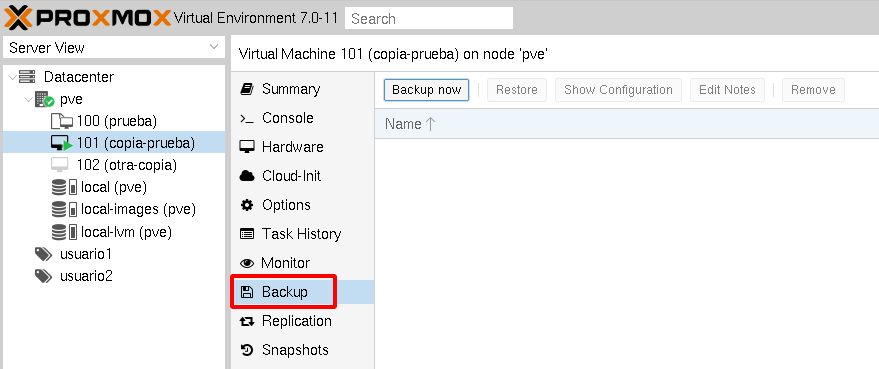
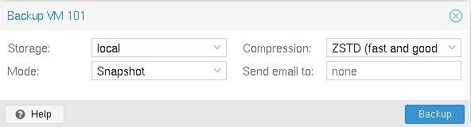
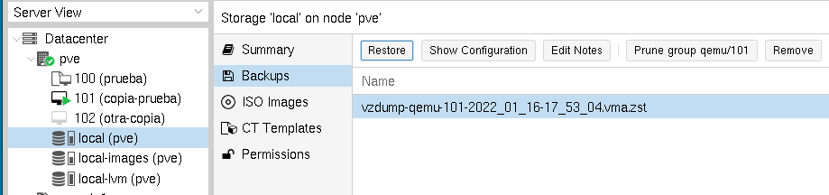
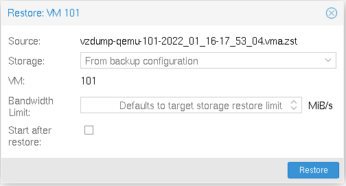
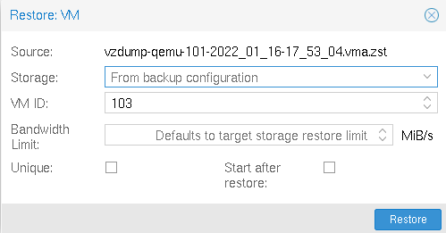

# Copias de seguridad de máquinas virtuales

Las copias de seguridad es otro mecanismo de seguridad que nos permite realizar copias donde se comprimirá en un archivo el almacenamiento completo de la máquina. Podemos realizar 3 tipos de copias de seguridad:

* **Stop mode**: La máquina se para y se realiza la copia. Garantizamos mayor consistencia de la copia de seguridad, a costa de un breve tiempo de inactividad. Si la máquina estaba corriendo, se parará, se realizará la copia y posteriormente se vuelve a arrancar.
* **Suspend mode**: Similar a la anterior, pero la máquina no se para, se suspende.
* **Sanpshot mode**: Este modo proporciona el tiempo de inactividad de operación más bajo, a costa de un pequeño riesgo de inconsistencia. En este modo se realiza la copia con la máquina funcionando.

Podemos ver las copias de seguridad de una máquina en el apartado **Backup**:

Con la opción **Backup now** creamos una nueva copia de seguridad, en la que indicaremos la fuente de almacenamiento donde se va a guardar la copia de seguridad, el modo de copia, el algoritmo de compresión y podemos indicar un correo para que nos notifique cuando se termine la copia de seguridad:

Si tenemos varios discos conectados a la máquina se realizará la copia de todos. Podemos ver la copia que hemos creado:

Vemos que, en el nombre del fichero de copia de seguridad, se indica el algoritmo de compresión, que es una máquina virtual (qemu), la fecha y la hora. La copia de seguridad que acabamos de crear también se puede ver desde la opción **Backup** de la fuente de almacenamiento `local`:

A partir de un fichero de copia de seguridad podemos hacer varias operaciones: borrarla (**Remove**), obtener información (**Show Configuration**), ...
Si queremos crear una nueva máquina a partir de dicha copia de seguridad elegiremos la opción **Restore**:

* Si lo hacemos desde el apartado **Backup** de la máquina virtual, la restauración de la copia de seguridad se realizará sobre la misma máquina virtual.

    

* Si lo hacemos desde el apartado **Backup** de la fuente de almacenamiento **local**, podremos crear una nueva máquina virtual a partir de la copia de seguridad.

    

En las dos formas podremos elegir en que almacenamiento se crea la nueva máquina.
