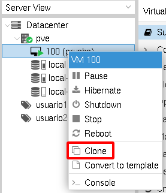
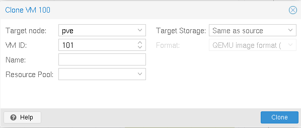
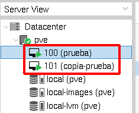

# Clonación de máquinas virtuales

Lo habitual al crear una máquina virtual es hacerlo a a partir de una imagen ISO. La clonación y las plantillas nos permiten la creación rápida de máquinas virtuales del mismo tipo.

Cuando usamos la clonación vamos a crear una nueva máquina virtual independiente del origen (**clonación completa**), en el que el almacenamiento es independiente a la primera.

Vamos a partir de que tenemos una máquina ya creada, para crear una exactamente igual a la primera realizamos la clonación:

En la siguiente pantalla de clonación:

Elegimos el ID, el nombre de la nueva máquina y la fuente de almacenamiento donde se va a producir la clonación (por defecto es el mismo que el de la máquina original). Una vez producida la clonación tendremos una nueva máquina virtual igual a la primera:

Las dos máquinas son iguales por lo que tendremos que modificar alguna configuración de la nueva máquina: por ejemplo, el hostname, la configuración de red si es necesario, ...

