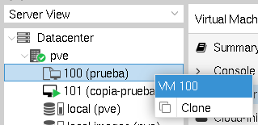
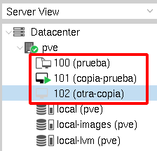
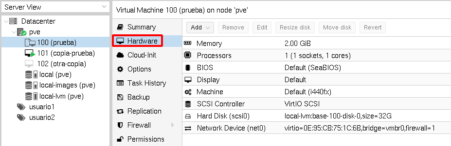

# Convirtiendo máquinas virtuales en plantillas

Otra manera de crear rápidamente nuevas máquinas virtuales es usar una plantilla para su creación. Si partimos de una máquina que ya tenemos configurada, la podemos convertir en una plantilla y a partir de ella crear nuevas máquinas.

Las plantilla son de solo lectura por lo que ya no podremos usar de nuevo la máquina original. Si utilizamos plantillas en lugar de máquinas clonadas, el proceso de obtención de la nueva máquina será mucho más rápido, ya que se podrá utilizar **aprovisionamiento ligero** (a este tipo de clonación se llama **clonación ligera**) para su creación, es decir, el almacenamiento de la máquina virtual estará vinculada a la plantilla de la que procede, y estaremos ahorrando espacio de almacenamiento.

Es necesario que la máquina virtual que vamos a convertir en una plantilla esté parada, y para convertirla en una plantilla:

Al convertir la máquina a una plantilla observamos que cambia el icono de identificación y que la única opción que nos permite es clonarla:

Al elegir la opción de clonación a partir de la plantilla que hemos creado, nos aparece la siguiente ventana:

Donde indicamos el ID y nombre de la nueva máquina y podemos elegir los dos tipos de clonación que hemos estudiado:

* **Clonación completa** (Full Clone): Sería exactamente como el proceso de clonación que hemos estudiado en la unidad anterior. El almacenamiento de la nueva máquina virtual es independiente al de la original. En este caso podremos escoger el pool de almacenamiento donde se va  a crear.
* **Clonación ligera** (Linked clone): En este caso estaríamos creamdo el almacenamiento de la nueva máquina con aprovisionamiento ligero, por lo cual la imagen de la plantilla sería la imagen base de la nueva máquina que tendría un almacenamiento que iría creciendo conforme se fueran produciendo cambios en la máquina. Como consecuencia, si elegimos este tipo de clonación, al crear las nuevas máquinas no ocuparían espacio de almacenamiento.

La clonación ligera nos permite crear nuevas máquinas virtuales de forma muy rápida, ya que no hay que copiar todo el almacenamiento de la maquina original a la nueva.

Como en el apartado anterior, las dos máquinas son iguales por lo que tendremos que modificar alguna configuración de la nueva máquina: por ejemplo, el hostname, la configuración de red si es necesario, …

Por ultimo, indicar que podemos cambiar las características hardware de una plantilla (por ejemplo el usa de RAM). De esta forma las nuevas máquinas creadas a partir de ella tendrán las mismas características que hemos modificado::

