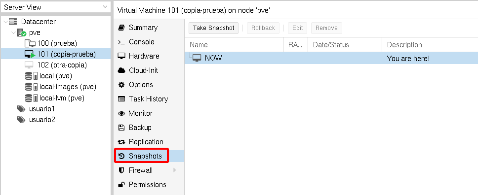
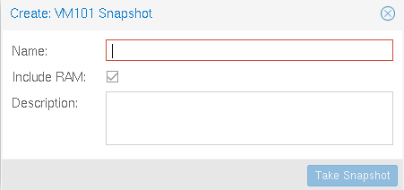

# Snapshots de máquinas virtuales

Un snapshot (instantánea) nos posibilita guardar el estado de una máquina virtual en un determinado momento. De esta forma en el futuro puedo volver a un estado anterior de la misma. Las dos fuentes de almacenamiento que estamos utilizando, ficheros de imagen QCOW2 y LVM, nos permiten la creación de snapshots.

Para crear un nuevo snapshot, elegimos la opción **Snapshots** del menú de opciones de la máquina:

Como podemos observar no tenemos guardado ningún estado de la máquina, para crearlo elegimos la opción **Take Snapshot** y podremos indicar un nombre, y guardamos, además del estado del almacenamiento, el estado de la RAM, y una información descriptiva:

Comprobamos que hemos creado el snapshot:

Si elegimos un snapshot podremos borrarlo (**Remove**), modificar su información (**Edit**) y, lo más importante, hacer que la máquina virtual vuelva al estado en la que se tomó el snapshot con la opción **Rollback**.

Puede ser muy interesante tomar instantáneas periódicamente a una máquina virtual. Si tenemos cualquier problema con la máquina podemos volver a un estado estable anterior. 

En un ámbito educativo, como son nuestros ciclos formativos de Formación Profesional, el uso de esta característica puede ser muy útil para el alumno, ya que puede experimentar distintas soluciones y si tienen algún problema, puede volver al estado original y no tener que eliminar la máquina.

* [Vídeo: Snapshots de máquinas virtuales](https://youtu.be/OpOj6tYw4L4)
