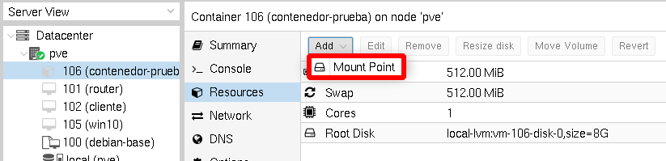
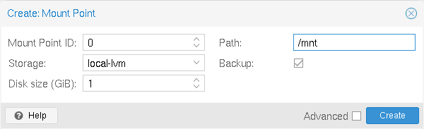
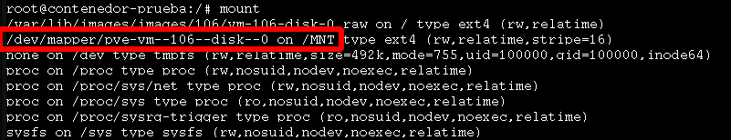

# Añadir almacenamiento a un contenedor LXC

Podemos crear un volumen y montarlo en un directorio de un contenedor LXC.

Para ello escogemos el contenedor y elegimos la opción **Resources** y añadimos un **Mount Point**:

A continuación, elegimos la fuente de almacenamiento donde vamos a crear el volumen, su tamaño y el directorio donde se va a montar en el contenedor:

Y comprobamos que se ha montado el volumen en el directorio indicado:

