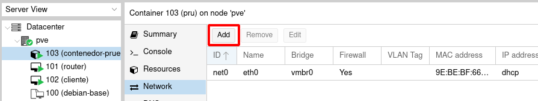
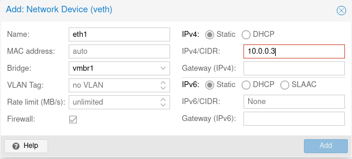

# Conexión de un un contenedor LXC a la red interna

De forma similar al estudiado en el punto anterior, podríamos conectar un contenedor LXC a una red interna.

## Añadir una nueva interfaz de red a un contenedor

Si quisiéramos añadir una nueva interfaz a un contenedor LXC, elegimos la opción **Network** del contenedor para ver las interfaces que tiene configurada y pulsar el botón **Add** para añadir una nueva:

Podemos nombrar la nueva interfaz de red y el bridge al que se conectará, indicando directamente el direccionamiento estático:

## Crear un contenedor conectado a una red interna

En el caso de la creación de un contenedor LXC podemos configurar la interfaz de red conectada al nuevo bridge, indicando directamente el direccionamiento estático:

