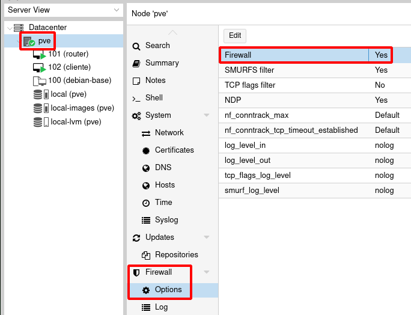
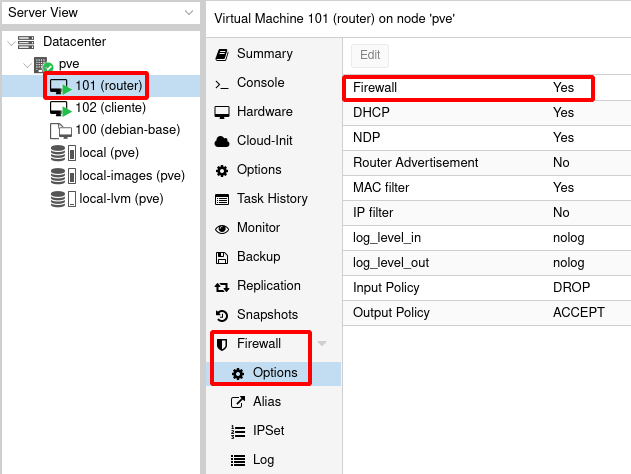
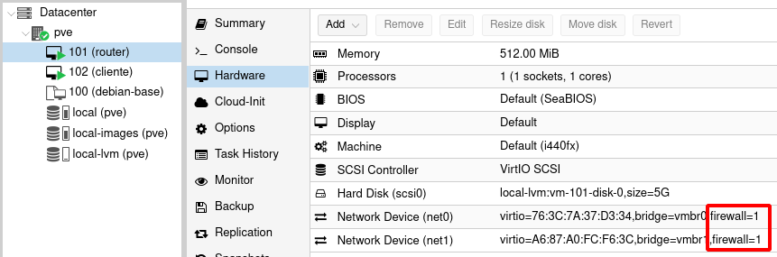
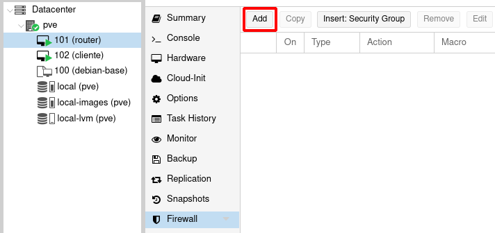
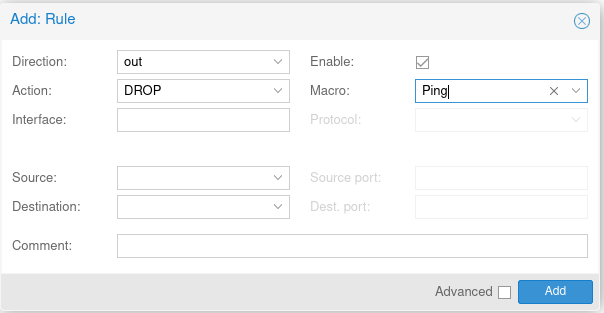
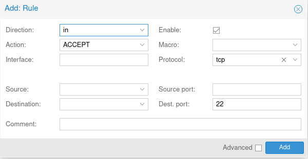
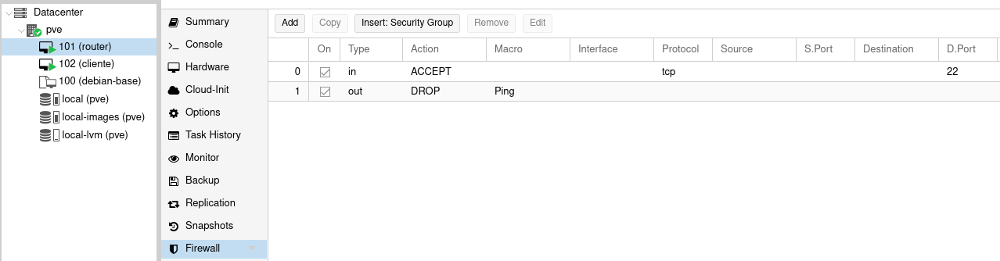
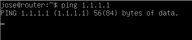

# Introducción al cortafuegos de Proxmox VE

La naturaleza de este curso no nos permite abarcar con profundidad aspectos relacionados con la seguridad de nuestro servidor Proxmox VE, pero si podemos hacer una introducción al cortafuego que nos ofrece el sistema para asegurar el acceso, tanto al servidor como a las máquinas virtuales y contenedores que gestionemos.

## Activación del cortafuego

El cortafuego hay que activarlos a tres niveles:

### A nivel de Datacenter

Para activar el cortafuego a nivel del clúster de servidores, tenemos que activar en la opción **Datacenter - Firewall - Options**:

En este nivel también puedes configurar **Security Group** (conjuntos de reglas de cortafuegos que posteriormente podemos asignar a un cortafuego de una máquina), **Alias** (que nos permite nombrar direcciones IP para que sea más sencillo crear las reglas de cortafuego) y **IPSec** (que nos permite crear grupos de IP para facilitar la asignación de reglas de cortafuego a varias IP). Estos elementos no lo vamos a usar en este curso.

### A nivel de Servidor

En este caso volvemos a activar el cortafuegos eligiendo la opción **pve - Firewall - Options**:

Activamos el cortafuego a nivel del servidor, se utilizan las políticas de entrada y salida por defecto que se habían configurado en el nivel de Datacenter, pero se mantienen abierto el puerto 8006 (para acceder a la página web) y el 22 (para el acceso por ssh al servidor).

### Nivel de máquina/contenedor

Para activar el cortafuego para una máquina/contenedor nos vamos a la opción **Firewall - Options** del recurso:

Vemos las políticas por defecto para esta máquina: 

* **Input policy: DROP**, es decir se deniega todo el tráfico de entrada (y tenemos que crear reglas de cortafuego para permitir el tráfico que nos interese).
* **Output Policy: ACCEPT**, se acepta todo el tráfico de salida de la máquina (y tenemos que indicar las reglas de cortafuego para denegar el tráfico que no permitamos).

Si quisiéramos un cortafuego más restrictivo pondríamos las dos políticas por defecto a DROP, es decir, tanto el tráfico de entrada como el de salida estaría bloqueado, y tendríamos que ir creando reglas de cortafuego para aceptar el tráfico que deseáramos permitir.

Además cómo una máquina o contenedor pueden tener más de una interfaz podemos activar o desactivar el cortafuegos para cada interfaz. Por defecto el cortafuego está activo en cada interfaz, para comprobarlo vemos las características hardware de las interfaces:

Podemos modificar las características del interfaz de red para desactivar el cortafuego.

**Resumen: Para poder habilitar el cortafuegos para una máquina virtual/contenedor, debemos habilitar el cortafuegos tanto a nivel de Datacenter como a nivel del servidor, finalmente podemos activar o desactivar el cortafuego para cada una de las interfaces de red de una máquina o contenedor.**

## Creación de reglas de cortafuego

Como hemos visto anteriormente si habilitamos el cortafuego para una máquina tendrá permitido el tráfico hacia el exterior (Output Policy: ACCEPT) y tendrá denegado el tráfico desde el exterior a la máquina (Input policy: DROP).

Partimos de una máquina que tiene un servidor ssh instalado. Está maquina tendrá conectividad al exterior, pero no tendra conectividad desde el exterior. Vamos a poner dos ejemplos de reglas:

### Regla para denegar que la máquina haga ping al exterior

Todo el tráfico esta permitido hacía el exterior pero vamos a denegar el ping. Para ello debemos crear una regla de salida para denegar el protocolo ICMP, para ello, a nivel de máquina virtual, vamos a añadir una regla al cortafuego, eligiendo la opción **Firewall - Add**:

Ahora creamos la regla de cortafuegos, indicando si es de entrada o salida (en nuestro caso dirección **out**), la acción **DROP**, si fuera necesaria podríamos poner la ip de origen y destino, indicamos el servicio que, en este caso, queremos denegar. en este ejemplo lo vamos a elegir directamente desde una lista de servicios que encontramos en el parámetro **Macro** y por último, activamos esta regla. Quedaría del siguiente modo:

## Regla para permitir el acceso por ssh a la máquina

En esta ocasión tenemos que crear una regla que permita (acción **ACCEPT**) la entrada (dirección **in**) por el puerto de destino 22 del protocolo TCP. En esta ocasión no vamos a elegir el servicio de la lista de **Macro**, lo vamos a indicar directamente. Quedaría:

## Prueba de funcionamiento

Como podemos comprobar hemos creado dos reglas:

Podemos comprobar que aunque tiene permitido todo el acceso al exterior hemos bloqueado la posibilidad de que haga ping:

Y podemos comprobar que desde una máquina externa podemos acceder por ssh, aunque todo el tráfico desde el exterior estaba bloqueado:

