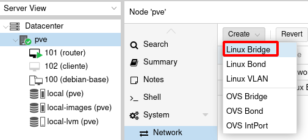
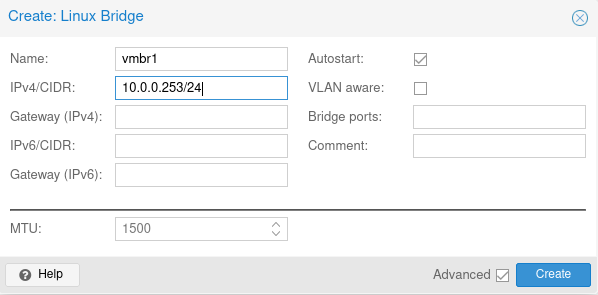
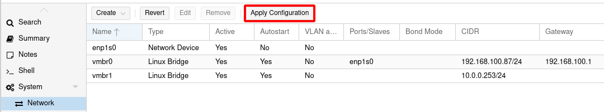

# Configuración de una red interna

Como hemos estudiado anteriormente, las máquinas virtuales y contenedores conectados al bridge **vmbr0** obtendrán direccionamiento automático, tendrán acceso al exterior y podremos acceder a ellos sin ningún problema.

Además, Proxmox VE nos permite crear nuevos **Linux Bridge** donde podremos conectar nuestras máquinas en una red privada. Algunos escenarios donde podríamos usar esta posibilidad podrían ser:

* Varias máquinas conectadas al exterior con una interfaz conectada a **vmbr0** y otra interfaz conectada a otro bridge. Estas máquinas tendrían una conexión entre ellas en una red privada.
* Un equipo que funcione como router/nat/cortafuegos que esté conectado al exterior por **vmbr0** y a otras redes internas donde tenemos diferentes máquinas.
* Un laboratorio de máquinas que no tengan conectividad al exterior y que estén conectadas a una red interna.

## Creación de un nuevo bridge

Para crear un nuevo bridge tenemos que elegir la opción **System - Network - Create - Linux Bridge**:

En la creación del bridge tendremos que configurar los siguientes parámetros:

* El **nombre** del bridge: debe tener el formato de *vmbr* y un número. 
* Aunque no es necesario, podríamos asignarle una **ip al bridge** (normalmente los switch tienen una IP que nos permiten acceder a ellos para configurarlos).
* Si indicamos la **ip del Gateway** lo que estaríamos haciendo es conectar una interfaz virtual del servidor Proxmox a este bridge, por lo que desde el servidor Proxmox tendríamos conectividad con las máquinas conectadas a este bridge. En nuestro caso no la vamos a indicar porque no vamos a usar esta funcionalidad.
* Y finalmente es importante activar el **Autostart** para que el bridge se levante tras un reinicio.

Una vez creado o modificado algún elemento de la red de Proxmox VE debemos aplicar los cambios para que verdaderamente se produzca el cambio de configuración:

