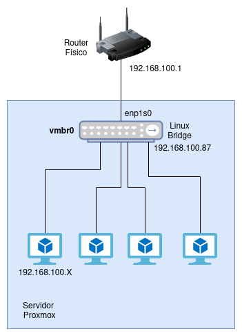
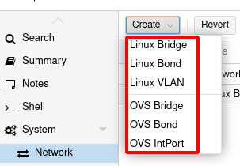
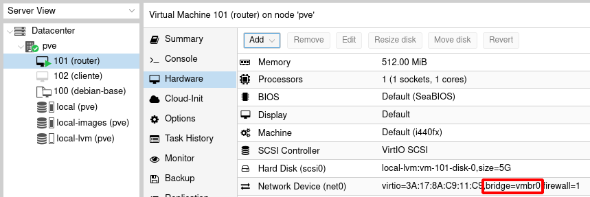

# Configuración de la red del servidor Proxmox VE

La configuración de red en Proxmox VE se ofrece a nivel de servidor (es decir, cada nodo que forma el clúster tendrá su configuración de red). En nuestro caso, como solo tenemos un nodo, podemos obtener la configuración inicial de red a nivel del servidor, en la opción **System - Network** del nodo:

En este curso hemos instalado Proxmox VE sobre una máquina virtual, y en nuestro escenario nos aparecen los siguientes recursos:

* **La interfaz del servidor Proxmox (en el ejemplo, enp1s0)**: Corresponde a la interfaz del servidor.
* **Un Linux Bridge (vmbr0)**: A este bridge está conectado la interfaz de del servidor y ha tomado del router físico un ip por DHCP (en mi caso la `192.168.100.87`). Esta ip corresponde a la IP del servidor y es la que utilizo para acceder a la página web de Proxmox.

Por defecto las máquinas virtuales y contenedores que estamos creando se conectan a este Linux Bridge, por lo tanto tomaran direccionamiento del router físico, en mi caso el direccionamiento será el `192.168.100.0/24`. Por lo tanto todas las máquinas gestionadas por Proxmox serán accesibles desde cualquier ordenador de mi red local.

El esquema que tenemos sería el siguiente:

En una instalación real de Proxmox el servidor puede tener más interfaces de red, podría existir un switch físico en la infraestructura y podríamos necesitar una configuración más avanzada usando por ejemplo **Bonding** (Link Aggregation) o **VLAN**. Proxmox VE nos permite configurar estas opciones avanzadas usando **Linux Bridge** o **Open vSwitch** (otra tecnología que nos permite trabajar con switch software). En este curso no se va a abordar el estudio de estas características avanzadas.

## Conexión de las máquinas virtuales/contenedores al bridge vmbr0

Como hemos indicado anteriormente, por defecto, las máquinas virtuales y contenedores que hemos creado en nuestro servidor se conecta al bridge **vmbr0**, por lo tanto se configurarán de forma automática usando el servidor DHCP de nuestra infraestructura, en nuestro caso el del router físico.

Y podemos comprobar que ha tomado una ip en el direccionamiento que reparte nuestro servidor DHCP:

Por lo que podemos acceder a ella desde cualquier equipo conectada a nuestra red local.