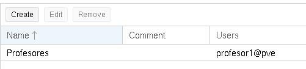
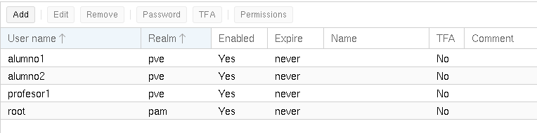
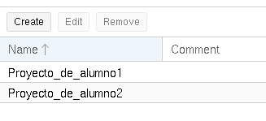
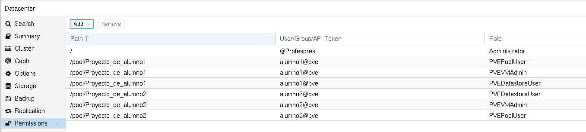
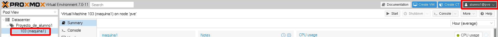
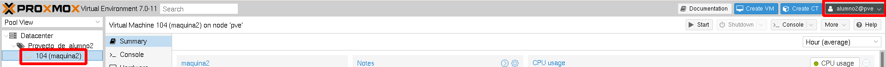
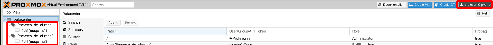

# Ejemplo 2: Aislamiento de usuarios

En el ejemplo anterior todos los usuarios trabajaban sobre los mismos recursos. En algunos escenarios sería deseable que cada usuario pudiera gestionar sus recursos. Esta idea vendría muy bien en la utilización de Proxmox VE en un centro educativo: cada alumno podría gestionar sus recursos y no podría interferir en los recursos de un compañero. 

Para conseguir este comportamiento vamos a asignar a cada usuario un Pool de Recursos y le vamos a dar los permisos necesarios para que el usuario sólo pueda gestionar los recursos que pertenecen a su Pool de Recursos.

Además podríamos tener un grupo de profesores que fueran administradores y que tuvieran acceso a todas las funcionalidades y recursos de los alumnos.

## Configuración del escenario

1. Vamos a crear un grupo **Profesores** al que le vamos a asignar el rol de `Administrator`.
2. Para cada usuario que creemos para un alumno, crearemos un Pool de Recursos. Por ejemplo vamos a crear el usuario `alumno1` y el Pool de Recursos `Proyecto_de_alumno1`.
3. A cada alumno le vamos a asignar los roles de `PVEDatastoreUser`, `PVEVMAdmin` y `PVEPoolUSer` para el Pool de Recursos asociado. De esta manera cada alumno podrá gestionar sus máquinas si están creados en su Pool de Recursos.

Hemos creado el grupo **Profesores** con el usuario **profesor1**:

Además hemos creado dos usuarios alumnos (estos usuarios no lo hemos asignados a ningún grupo):

Hemos creado dos Pools de Recursos para cada uno de los usuarios alumnos:

Para que los usuarios puedan crear máquinas virtuales en sus Pools de Recursos necesitarán que las fuentes de almacenamiento que tenemos definidas sean miembros del Pool de Recurso. Por lo que para cada Pool de Recursos le añadimos las fuentes de almacenamiento que queremos que usen los usuarios:

Y por último asignamos los permisos:

## Prueba de funcionamiento

1. Accedemos con el usuario `alumno1` y comprobamos que sólo ve el Pool de Recursos `Proyecto_de_alumno1`. Este usuario sólo tiene permiso para crear máquinas dentro de este Pool de Recursos. Podemos probar a crear una máquina en su Pool de Recurso:

2. Al acceder con el usuario `alumno2` nos damos cuenta que sólo se ve su Pool de Recursos `Proyecto_de_alumno2`. No puede ver, ni modificar, ni borrar las máquinas del `alumno1`. Este usuario puede crear una máquina en su Pool de Recursos:

3. Si accede el usuario `profesor1` podrá gestionar todas las máquinas de todos los usuarios:

