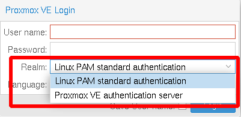
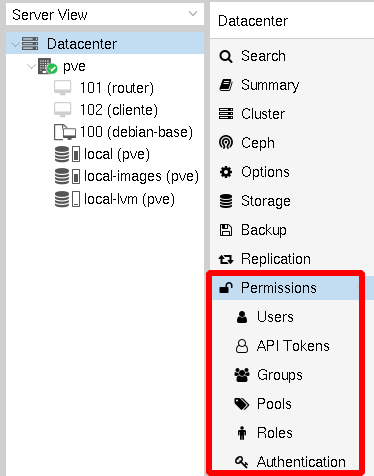

# Introducción a la gestión de usuarios

Proxmox permite varias fuentes de autentificación de usuarios (**Realm**), las dos más utilizadas serían:

* *Linux PAM Standard Authentication*: Serían usuarios físicos del servidor Proxmox. Por ejemplo, el usuario *root* que hemos usado en el curso sería de este tipo. Estos usuarios pueden conectar la consola del servidor (opción **Shell**) y acceder por ssh al servidor.
* *Proxmox VE Authentication Server*: No son usuarios físicos del servidor.Se usan cuando el usuario no es necesario que acceda al servidor Proxmox. En este caso, los usuarios están totalmente gestionados por Proxmox VE y pueden cambiar sus propias contraseñas a través de la GUI. 

Podemos tener más fuentes de autentificación, que en este curso no vamos a tratar: servidor LDAP, Directorio Activo, ...
Al acceder al la GUI debemos elegir la fuente de autentificación donde se tiene que buscar el usuario:

Cada usuario puede ser miembro de varios **grupos**. Los grupos son la forma preferida de organizar los permisos de acceso. Siempre debes conceder permisos a grupos en lugar de a usuarios individuales. De esta manera, obtendrá una lista de control de acceso mucho más fácil de mantener.

## Gestión de usuarios

Para gestionar usuarios, grupos, permisos, elegimos la opción **Permissions** en el nivel del **Datacenter**:

* *Permissions*: Nos permite gestionar los permisos para limitar las acciones permitidas a usuarios o grupos.
* *Users*: Para gestionar los usuarios.
* *API Tokens*: Generar los tokens para el acceso ala API de Proxmox VE. No lo vamos a estudiar en este curso.
* *Groups*: Gestión de los grupos de usuarios.
* *Pools*: Gestión de los **Grupos de Recursos** o **Pools de recursos**. Un grupo de recursos es un conjunto de máquinas virtuales, contenedores y pools de almacenamiento. Profundizaremos en este concepto en los próximos capítulos.
* *Roles*: Gestiona los **Roles**: Los Roles son **conjuntos de permisos**. También lo estudiaremos más adelante.
* *Authentification*: Nos permiote gestionar las fuentes de autentificación disponibles.

