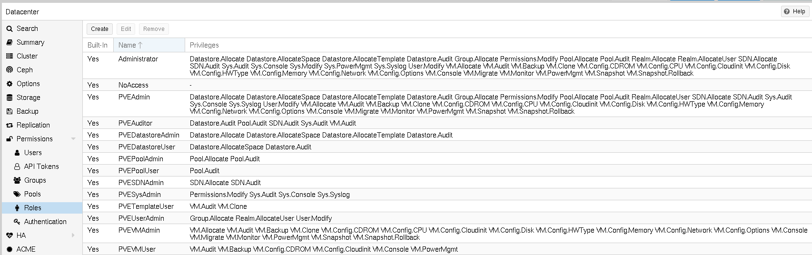
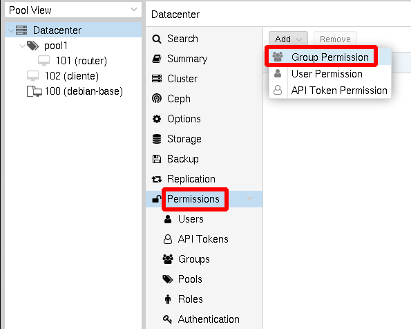
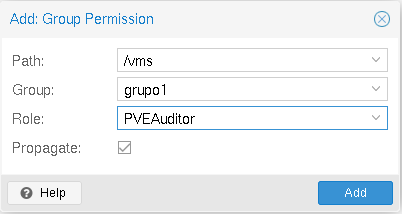

# Gestión de Permisos

Un **privilegio** es el derecho a realizar una acción específica. Para simplificar la gestión, las listas de privilegios se agrupan en **roles**, que luego pueden utilizarse en la **tabla de permisos**. Tenga en cuenta que los privilegios no pueden asignarse directamente a los usuarios y a las rutas sin formar parte de un rol.

## Privilegios

* Privilegios relacionados con el nodo/sistema:

    * `Permissions.Modify`: modificar los permisos de acceso.
    * `Sys.PowerMgmt`: gestión de la energía del nodo (arranque, parada, reinicio, apagado, ...).
    * `Sys.Console`: acceso a la consola del nodo.
    * `Sys.Syslog`: ver el syslog.
    * `Sys.Audit`: ver el estado/configuración del nodo, la configuración del clÚster.
    * `Sys.Modify`: crear/modificar/eliminar los parámetros de red del nodo.
    * `Group.Allocate`: crear/modificar/eliminar grupos.
    * `Pool.Allocate`: crear/modificar/eliminar un pool.
    * `Pool.Audit`: ver un pool.
    * `Realm.Allocate`: crear/modificar/eliminar fuentes de autenticación.
    * `Realm.AllocateUser`: asignar un usuario a un dominio.
    * `User.Modify`: crear/modificar/eliminar el acceso y los detalles del usuario.

* Privilegios relacionados con la máquina virtual:

    * `VM.Allocate`: crear/eliminar VM en un servidor.
    * `VM.Migrate`: migrar la VM a un servidor alternativo en el clúster.
    * `VM.PowerMgmt`: gestión de la energía (arranque, parada, reinicio, apagado, ...).
    * `VM.Console`: acceso a la consola de la VM.
    * `VM.Monitor`: acceso al monitor de la VM (kvm).
    * `VM.Backup`: copia de seguridad/restauración de VMs.
    * `VM.Audit`: ver la configuración de la VM.
    * `VM.Clone`: clonar/copiar una VM.
    * `VM.Config.Disc`: añadir/modificar/eliminar discos.
    * `VM.Config.CDROM`: expulsar/cambiar CD-ROM.
    * `VM.Config.CPU`: modificar la configuración de la CPU.
    * `VM.Config.Memory`: modificar la configuración de la memoria.
    * `VM.Config.Network`: añadir/modificar/eliminar dispositivos de red.
    * `VM.Config.HWType`: modificar los tipos de hardware emulados.
    * `VM.Config.Options`: modificar cualquier otra configuración de la VM.
    * `VM.Snapshot`: crear/borrar instantáneas de la VM.

* Privilegios relacionados con el almacenamiento:

    * `Datastore.Allocate`: crear/modificar/eliminar un pool de almacenamiento y eliminar volúmenes.
    * `Datastore.AllocateSpace`: asignar espacio en un pool de almacenamiento.
    * `Datastore.AllocateTemplate`: asignar/cargar plantillas e imágenes ISO.
    * `Datastore.Audit`: ver/examinar un pool de almacenamiento.

## Roles

Como se ha indicado los privilegios no se asignan directamente, los **roles** son conjuntos de privilegios que son los que se van a asignar para otorgar los permisos. Los roles predefinidos que tenemos los siguientes:

* `Administrador`: tiene todos los privilegios.
* `NoAccess`: no tiene privilegios (se utiliza para prohibir el acceso).
* `PVEAdmin`: puede realizar la mayoría de las tareas, pero no tiene derechos para modificar la configuración del sistema.
* `PVEAuditor`: sólo tiene acceso de lectura.
* `PVEDatastoreAdmin`: crea y asigna el espacio y las plantillas de las copias de seguridad.
* `PVEDatastoreUser`: asigna el espacio de copia de seguridad y ve el almacenamiento.
* `PVEPoolAdmin`: asigna pools.
* `PVESysAdmin`: ACLs de usuario, auditoría, consola del sistema y registros del sistema.
* `PVETemplateUser`: ver y clonar plantillas.
* `PVEUserAdmin`: gestionar usuarios.
* `PVEVMAdmin`: administrar completamente las VMs.
* `PVEVMUser`: ver, hacer copias de seguridad, configurar el CD-ROM, la consola de la VM, la gestión de la energía de la VM.

Podemos crear nuevos roles para asignar nuevos perfiles de usuarios.

## ASignación de permisos

Los permisos (**roles**) se asignan a un **usuario o grupo** y a un **objeto** (máquina viretual/contenedoir, pool de almacenamiento, grupo de recursos,...). Utilizamos rutas similares a las del sistema de archivos para indicar los objetos. Estas rutas forman un árbol y los permisos de niveles superiores (rutas más cortas) pueden propagarse opcionalmente hacia abajo dentro de esta jerarquía.

Ejemplo de rutas:

* `/vms`: Indiica todas las máquinas virtuales
* `/vms/{vmid}`: Indica una máquina virtual con un id determinado.
* `/storage/{storeid}`: Indica un pool de almacenamiento con un id determinado.
* `/pool/{poolname}`: Indica un grupo de recursos con un nombre de terminado.
* ...

Como hemos indicado un permiso esta formado por una terna: Usuario/Grupo, Objeto/Ruta y Rol. Por ejemplo vamos a signar a los usuarios del *grupo1* permiso de auditor (`PVEAuditor`) para todas las máquinas virtuales.

Lo primero escogemos que vamos a asignar un permiso a un grupo:

A continuación indicamos el objeto/ruta, el grupo y el rol:

Y podemos ir viendo los permisos que estamos asignando:

