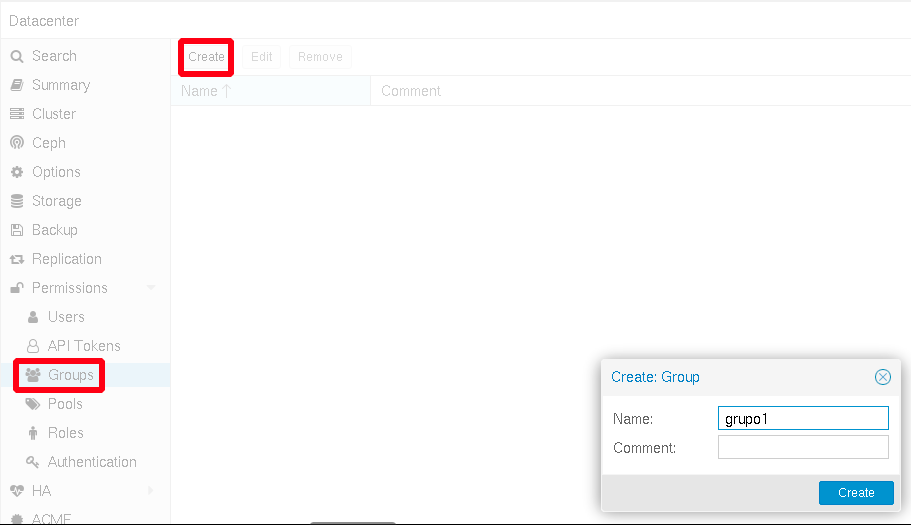

# Gestión de Usuarios y Grupos

## Creación de Grupos

Para crear un grupo solamente es necesario indicar su nombre y opcionalmante un comentario:

Los grupos se pueden editar (para cambiar el nombre o el comentario) y eliminar.

## Creación y gestión de Usuarios

Al crear un usuario tenemos que escoger la fuente de autentificación (en este ejemplo vamos a escoger *Proxmox VE Authentication Server*):

Ademas del nombre de usuario y la contraseña, podremos indicar la siguiiente información:

* Nombre
* Apellido
* Dirección de correo electrónico
* Grupo al que pertenece
* Una fecha de caducidad opcional
* Un comentario o nota sobre este usuario
* Si este usuario está habilitado o deshabilitado
* ...

Los usuarios se pueden modificar, borrar, podemos cambiar su contraseña, ...

